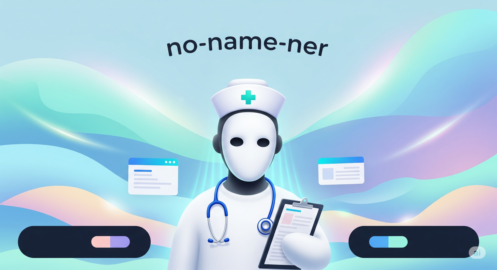
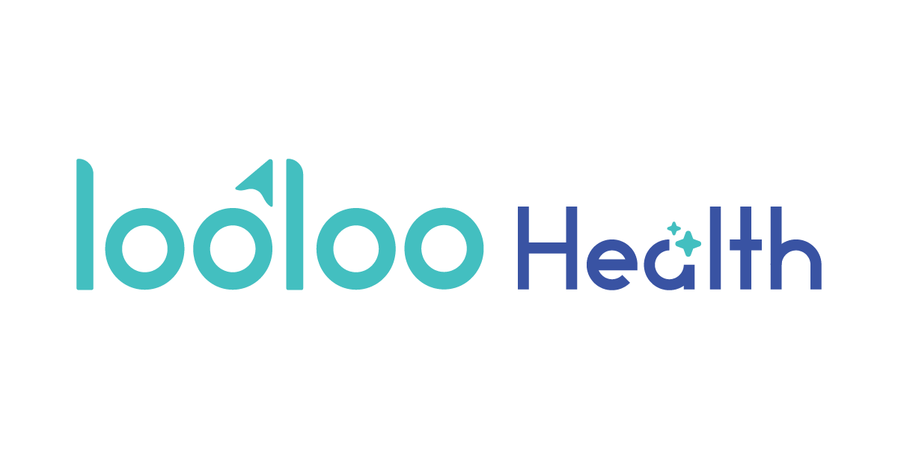

# `no-name-ner-th`: A Powerful and Accessible De-identification Model for Thai Texts


<p align="center">
  
</p>

<p align="center">
  
  
</p>


[🤖 **Model**](https://huggingface.co/loolootech/no-name-ner-th) | [📔 **Jupyter Notebook**](example.ipynb) | [🤗 **Huggingface Space Demo**](https://huggingface.co/spaces/loolootech/no-name-ner-th-demo) | [🩺 **Looloo Health**](https://looloohealth.com/en/)**


At [Looloo Health](https://looloohealth.com/en/), we're passionate about making healthcare more accessible and affordable for everyone. We believe that unlocking the potential of clinical data is key to this goal, and we're excited to share our work with the community.

`no-name-ner-th` is a powerful and accessible model designed to de-identify sensitive information from unstructured Thai texts. It was developed to overcome key challenges in handling private data and is used to power real-world applications in healthcare.


### **The Challenge**
Developing reliable AI for sensitive data is difficult due to **data scarcity** from privacy regulations like **HIPAA** and **PDPA**. This leads to models that fail to generalize. The manual de-identification of data is impractical, while using cloud-based LLMs poses **security risks**. Additionally, the need for expensive GPU hardware creates a **digital divide**.


### **Our Solution**
To overcome data scarcity, we trained our model on a **synthetic dataset of over 300,000 samples**, ensuring it is robust and generalizable. `no-name-ner-th` provides comprehensive de-identification, replacing sensitive data with descriptive tokens to preserve context. It is also **optimized to run on standard CPUs**, making it efficient and widely accessible.

### **Use Cases**
The model is a core component of our AI Medical Scribe, [**PresScribe**](https://www.youtube.com/watch?v=oUiJ9oPgZMA), where it helps ensure patient privacy through automated de-identification.

Beyond clinical documentation, the model can be applied to:

* **Advancing medical research** by enabling access to de-identified patient data.

* Building **clinical data lakes** that support large-scale healthcare analytics.

* **Training healthcare-specific large language models (LLMs)** on quality data without compromising privacy.

On our internal test set, we achieved over 95% accuracy for our specific use case.

By sharing this tool, we hope to foster a more collaborative and innovative global health tech community — and we’re excited to see what you will build with it 🤗

## **Quick Start**

```sh
git clone https://github.com/loolootech/no-name-ner-th.git
cd no-name-ner-th
pip install -r requirements.txt
```


```python
from transformers import pipeline

# Load the NER model
ner_model = pipeline("token-classification", model="loolootech/no-name-ner-th", device="cpu")

input_text = "คนไข้ชื่อสมชาย ได้รับยาจากหมอเหน่ง ให้โทรหาที่เบอร์ 081-123-4567"

# Get the raw output from the model
ner_results = ner_model(input_text)
```

To get an anonymized, context-preserving output like 

`"คนไข้ชื่อ[PERSON] ได้รับยาจาก[PERSON] ให้โทรหาที่เบอร์[PHONE]"`

, the raw model results must be processed. This involves replacing the identified entities with a defined set of tokens.

A simple, robust post-processing function is demonstrated in this [example notebook](example.ipynb). It handles cases with multi-word and overlapping entities, ensuring accurate and reliable de-identification of the final text.

### **Running the Gradio UI Application**
---
```sh
pip install gradio fastapi uvicorn
python app.py
```

## Disclaimer

* This model is intended as an assistive tool for de-identification. It is not a substitute for professional, legal, or medical advice.

* Users are fully responsible for ensuring compliance with applicable privacy, legal, and regulatory requirements.

* While efforts have been made to improve accuracy, no automated system is 100% reliable. We strongly recommend implementing a regular human review process to validate outputs.


## **License**
This work is licensed under the Creative Commons Attribution-NonCommercial 4.0 International License ([CC BY-NC 4.0](LICENSE)).

- For commercial usage, please contact contact@looloohealth.com.


## **Citation**

If you use the model, you can cite it with the following bibtex.

```
@misc {no_name_ner_th,
    author       = { Atirut Boribalburephan, Chiraphat Boonnag, Knot Pipatsrisawat },
    title        = { no-name-ner-th },
    year         = 2025,
    url          = { https://huggingface.co/loolootech/no-name-ner-th },
    publisher    = { Hugging Face }
}
```


## **Acknowledgement**
We extend our gratitude to the `PhayaThaiBERT` team and `Pavarissy/phayathaibert-thainer` for providing the initial checkpoint for our model, which served as a crucial starting point. We also acknowledge PyThaiNLP for their invaluable contribution of the `thainer-corpus-v2` dataset, which was essential for training and evaluation.
